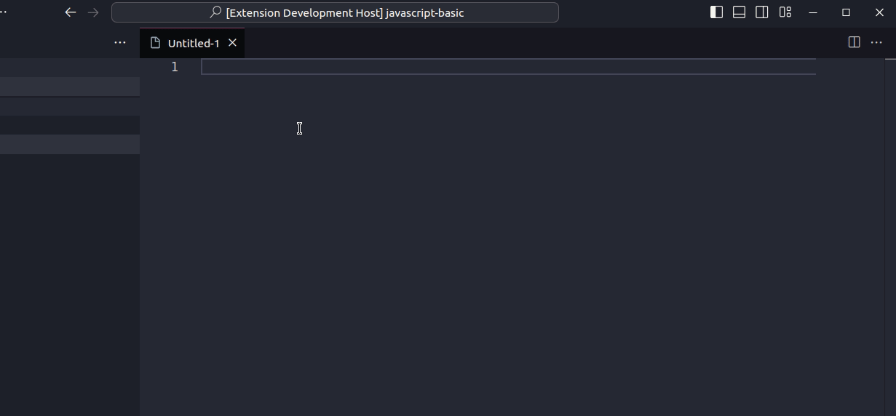

# vscode-plugin-unique-id
This plugin will assist developers in creating unique IDs through various strategies.

## Features

This plugin will assist in creating unique IDs using the strategies of uuid, uuid with a sequence, and current time in milliseconds.

## Requirements

Vscode 1.81.0+

## Known Issues

NDA

## Release Notes

Release Notes

### 2.1.0

Adding features

1. Create user sequence configuration;

### 2.0.0

Adding features

1. Create Id by NanoId;

### 1.0.0

Adding features

1. Create Id by UUID;
2. Create Id by current time in milliseconds;
3. Create Id by current time with sequence;
4. Reset sequence
